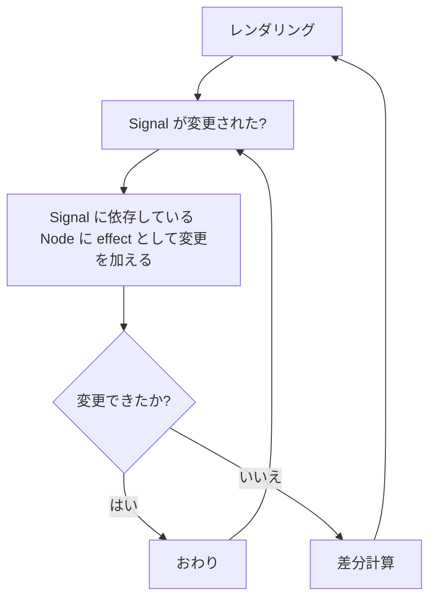

## 対象読者

* Qwik について何となく知っている
* Qwik がどのように DOM を操作しているのか気になる

## ???

> https://qwik.dev/docs/faq/#does-qwik-use-a-vdom-virtual-dom


要約
- Qwik は、 vDOM を用いることもありながら、同時に SolidJS のような直 DOM 置き換えを使用することがある
- 構造的な変化を伴うか伴わないかによってそれは判断される
- 控えめな仮想 DOM は優れた開発体験を提供する
- 例
    ```tsx
    export const Component = component$(() => {
        const count = useSignal(0)
        // 構造的でない
        return <div>
            <div>Count: {count.value}</div>
        </div>

        // 構造的
        return <div>
            {count.value > 10 ? <h1>カウントは10以上です</h1> : <div>カウントは10未満です</div>}
        </div>
    })
    ```

これらは理解できます。
三項演算子を使いたいとき、Vue Vapor や Svelte は独自テンプレート言語なので容易に直 DOM コードにコンパイルできます。しかし、SolidJS は JSX なので三項演算子を直 DOM にコンパイルするのは難しいです。だから Solid.js は Show コンポーネントなどを実装しているのですが、TypeScript との相性が悪いです。
Qwik はこのように三項演算子を使えるようにしつつ高速にするために「控えめ」な vDOM を使用しているのでしょう。

試しに以下の Qwik のコードをコンパイルしてみましょう。
```tsx
import { component$, useSignal } from '@builder.io/qwik'

export default component$(() => {
  const count = useSignal(0)
  return <button onClick$={() => count.value++}>
    {count}
  </button>
})
```

以下のようになります。
```ts
import { u as useSignal, _ as _jsxQ, q as qrlDEV } from './_qwikCore.js';
import './_qwikPreloader.js';

const app_component_Ncbm0Trxwgc = ()=>{
    const count = useSignal(0);
    return /*#__PURE__*/ _jsxQ("button", null, {
        onClick$: /*#__PURE__*/ qrlDEV(()=>import('./app.tsx_app_component_button_onClick_9tyWdQvbkh0.js'), "app_component_button_onClick_9tyWdQvbkh0", {
            file: "/app.tsx",
            lo: 149,
            hi: 168,
            displayName: "app.tsx_app_component_button_onClick"
        }, [
            count
        ])
    }, count, 3, "4e_0", {
        fileName: "app.tsx",
        lineNumber: 5,
        columnNumber: 10
    });
};

export { app_component_Ncbm0Trxwgc };
```

**めっちゃ React みたいな vDOM 使ってるじゃん！！！！！**


参考までに React/SolidJS/Svelte のコンパイル結果を置いておきます。

:::details React
```js
import React from 'react';
import { jsxs as _jsxs } from "react/jsx-runtime";
export default function App() {
  const [count, setCount] = React.useState(0);
  return /*#__PURE__*/_jsxs("button", {
    onClick: () => setCount(count + 1),
    children: ["Count: ", count]
  });
}
```
:::

:::details SolidJS
```js
import { template as _$template } from "solid-js/web";
import { delegateEvents as _$delegateEvents } from "solid-js/web";
import { insert as _$insert } from "solid-js/web";
var _tmpl$ = /*#__PURE__*/_$template(`<button>Count: `);
import { createSignal } from 'solid-js';
import { render } from 'solid-js/web';
function App() {
  const [count, setCount] = createSignal(0);
  return (() => {
    var _el$ = _tmpl$(),
      _el$2 = _el$.firstChild;
    _el$.$$click = () => setCount(count() + 1);
    _$insert(_el$, count, null);
    return _el$;
  })();
}
render(App, document.getElementById('app'));
_$delegateEvents(["click"]);
```
:::
:::details Svelte
```js
import 'svelte/internal/disclose-version';
import 'svelte/internal/flags/legacy';
import * as $ from 'svelte/internal/client';

var root = $.template(`<button> </button>`);

export default function App($$anchor) {
	let count = $.mutable_source(0);
	var button = root();
	var text = $.child(button);

	$.reset(button);
	$.template_effect(() => $.set_text(text, `Count: ${$.get(count) ?? ''}`));
	$.event('click', button, () => $.update(count));
	$.append($$anchor, button);
}
```
:::


紐解いていきます。

## コンポーネント単位 vDOM

Qwik は、コンポーネント単位でレンダリングしています。[^renderComponent]

React の State が変化したときのことを考えてみてください。ルートのコンポーネントが呼び出され、React Node (vDOM) が生成されます。それをもとに前回の vDOM との差分を計算して DOM に再レンダリングします。
それに対して Qwik は、コンポーネント単位で vDOM の差分計算を行っているのです。コンポーネントの中で Signal が変更された場合、そのコンポーネントのみが再実行され、差分が適用されます。

## Signal による DOM への介入

前述した Qwik のコンパイル後のコードでは、カウンタの Signal `count` を `.value` で参照せずに渡しています。Signal のオブジェクトごと子要素にしているイメージです。

Signal から DOM へ介入しているみたいなコード[^signals]がありますが、おそらく内部的に `count` の Signal に依存している DOM のノードを `count` へ注入し、`count` の変更時に effect として直接 DOM のノードを置き換えているのだと思います。

## まとめ



**多分**こんな感じ。コンポーネント単位 vDOM と Signal から直接 DOM を操作するという 2 つを組み合わせることによってパフォーマンスを高めながら vDOM を控えめに使用している。
訳わからん。

[^signals]: https://github.com/QwikDev/qwik/blob/main/packages/qwik/src/core/render/dom/signals.ts
[^renderComponent]: https://github.com/QwikDev/qwik/blob/e7149695543ce53b119bb5523cd43ad8890caf44/packages/qwik/src/core/render/dom/render-dom.ts#L19
