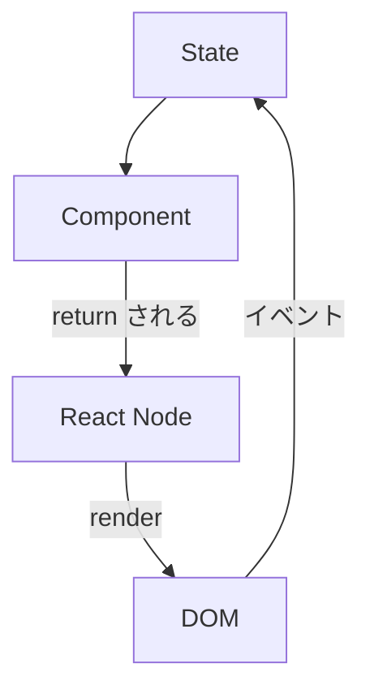
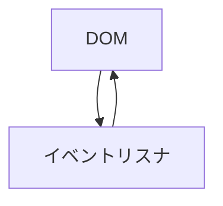
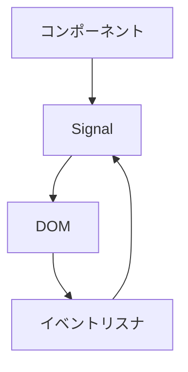

Solid.js 大好きな nakasyou が Solid.js の内部構造について説明します。Solid.js クローン作っていたので詳しいはずです。

## 前提知識: Solid.js の書き方

JSX を使います。
```tsx
import { createSignal } from 'solid-js'
import { render } from 'solid-js/web'

function App () {
  const [count, setCount] = createSignal(0)

  return <>
    <button onClick={() => setCount(count() + 1)}>
      Count: {count()}
    </button>
  </>
}

render(App, document.getElementById('app')!)
```
こんな感じで表面上は React みたいに書くことができます。

また、以下のような理由から Solid.js は "Simple" を名乗っています。
```tsx
import { createSignal } from 'solid-js'

// コンポーネント外で Signal を変更する
const [count, setCount] = createSignal(0)

function App () {
  console.log('これはコンポーネントのマウント時のみ出力されます、Signal を変更してもです。')

  return <div>{count()}</div>
}
```

これは表面上は Simple なのですが、裏側は Complex です。

## createSignal とは / Signal vs State

createSignal は、Signal を作成する関数です。

Solid.js は Signal をリアクティブシステムに使用しているのに対し、React は State をリアクティブシステムに使用しています。それらは何が違うのでしょうか。

State は State の変更時にコンポーネントを呼び出すための機能です。
```ts
const Component = () => {
  const [state, setState] = useState('Initial')
  return {
    crr: state
  }
}
```
setState を呼び出した場合、state が変更された後にコンポーネントがもう一度呼び出されて return された React Node を UI とします。
コンポーネントは `React.createElement(Component)` のように作成されますが、そのときに useState をモックして useState が呼び出された順番を記録して保存します。
これらが意味することは、 State のシステムは State を変えるとコンポーネント全体を計算しなければならないということです。

一方の Signal は、コンポーネントに限らず使用できる汎用的なリアクティブシステムです。このシステムは Svelte や Preact 、 Qwik などでも使用されています。
```ts
import { signal, effect } from '.....'

const count = signal(0)
effect(() => {
  console.log(count.value)
})
```
上の例では、count という signal を作成しています。effect を使うとハンドラの中にある signal を依存関係として記憶して、count の変更時にハンドラを呼び出しています。
```ts
let scope = []
const signal = (initial) => ({
  get value () {
    scope.push(this)
    return initial
  },
  set value (value) {
    initial = value
    for (const handler of _deps) {
      handler()
    }
  },
  _deps: []
})
const effect = (handler) => {
  const prev = scope
  handler()
  for (const dep of scope) {
    dep._deps.add(handler)
  }
  scope = prev
}
```
簡易的な実装は上のようになります。実際は依存 Signal を常に取得したり、メモリリークやバッチ処理などをする必要がありますが。
例では `count.value` の setter/getter を用いていますが、solid.js の Signal は `count()`, `setCount()` のようにしています。これは React に寄せているからだと思います。

では、なぜ Solid.js は Signal を用いているのでしょうか。

## DOM 操作は間接的?直接?

React のシステムは、State を Component に渡すことによって React Node という DOM の中間表現を得ます。
UI = Component(state) のような純粋関数を設計の根幹としているのです。得られた中間表現の差分をもとにブラウザ上に反映させるのです。


この仕組みの問題として有名なのは、React Node という中間表現を介してレンダリングすることの効率が悪いという点です。
例えば、
```js
// 疑似コード
const elem = document.getElementById('app')
const Component = () => {
  const [count, setCount] = state(0)
  return {
    type: 'div',
    children: [count]
  }
}
render(elem, Component)
```
よりも
```js
const elem = document.getElementById('app')
let count = 0
elem.onclick = () => {
  elem.textContent = count++
}
```
のように命令的な書き方をした方が早そうですよね。中間表現を介していないのですから。

しかし、これは保守的ではなく、バグを生む可能性が高いです。
これは React が存在する理由でもあります。

|  | React | 直接 DOM いじる |
| --- | --- | --- |
| UI | 宣言的 | 命令的 |
| 速度 | 遅い | 速い |
| 記述方式 | JSX/JS | JS |
| コード量 | 少ない | 少ない |

この 2 つはトレードオフですが、宣言的に書きたいです。では、直接 DOM に Signal とコンポーネントライクなシステムを持ち込みましょう。
```ts
const Component = () => {
  const count = signal(0)
  const elem = document.createElement('div')
  effect(() => {
    elem.textContent = count.value
  })
  elem.onclick = () => {
    count.value++
  }
  return elem
}
document.body.appendChild(Component())
```


宣言的に記述できました。

|  | React | 直接 DOM いじる | 直接 DOM + Signal |
| --- | --- | --- | --- |
| UI | 宣言的 | 命令的 | 宣言的 |
| 速度 | 遅い | 速い | 速い |
| 記述方式 | JSX/JS | JS | JS |
| コード量 | 少ない | 少ない | 多い |

しかし、コード量は多いですね。これを JSX で書きたいです。それを実現するのが Solid.js です。

Solid.js のコアは、直接 DOM + Signal を書きやすくするライブラリです。JSX をコンパイルして直 DOM のコードに変換します。
例えば、一番最初に書いた Solid.js のカウンタは、以下のようにコンパイルされます:

```js
import { template as _$template } from "solid-js/web";
import { delegateEvents as _$delegateEvents } from "solid-js/web";
import { insert as _$insert } from "solid-js/web";
var _tmpl$ = /*#__PURE__*/_$template(`<button>Count: `);
import { createSignal } from 'solid-js';
import { render } from 'solid-js/web';
function App() {
  const [count, setCount] = createSignal(0);
  return (() => {
    var _el$ = _tmpl$(),
      _el$2 = _el$.firstChild;
    _el$.$$click = () => setCount(count() + 1);
    _$insert(_el$, count, null);
    return _el$;
  })();
}
render(App, document.getElementById('app'));
_$delegateEvents(["click"]);
```

JSX を 直 DOM にコンパイルしています。ただ単にコンパイルすると遅かったりするので、HTML 文字列からノートをキャッシュしたりするなどいろいろなところで最適化の工夫がされています。

|  | React | 直接 DOM いじる | 直接 DOM + Signal | Solid.js |
| --- | --- | --- | --- | --- |
| UI | 宣言的 | 命令的 | 宣言的 | 宣言的 | 
| 速度 | 遅い | 速い | 速い | 速い |
| 記述方式 | JSX/JS | JS | JS | JSX |
| コード量 | 少ない | 少ない | 多い | 少ない |

このように、Solid.js は JSX を最適化しているのです。

### コンパイラ

babel-plugin-jsx-dom-expressions は JSX を最適化するための Babel Plugin です。
https://github.com/ryansolid/dom-expressions/tree/main/packages/babel-plugin-jsx-dom-expressions
テンプレート文字列の構築などもここで行われています。

また、
```tsx
import { createSignal } from 'solid-js'

function App () {
  console.log('これはコンポーネントのマウント時のみ出力されます、Signal を変更してもです。')

  return <div>{count()}</div>
}
```
の理由は、意図的にそうしているのではなく、コンパイラの都合上です。
React のようにコンポーネントを純粋関数としてみなしていません。単に signal の変更をそのまま DOM に適用しているだけなので、毎回呼び出すとパフォーマンスが低下します。

## 感想

自分でも何書いているのかよくわからなくなった、最初は Solid.js の黒魔術を書こうとしたけどまた今度にします。
